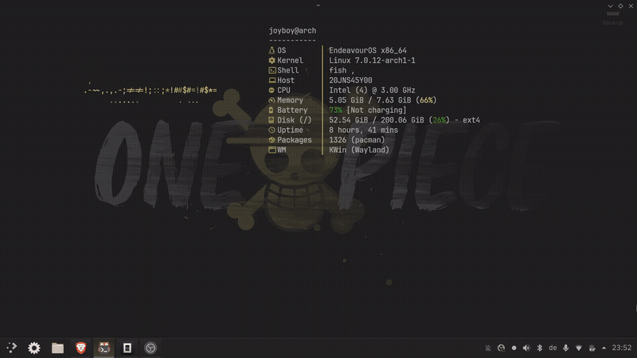

# 🌌 Jux Dotfiles — Arch Linux + KDE Plasma 6 + Hyprland

<p align="center">
  
</p>

<p align="center">
  <a href="https://archlinux.org"></a>
  <a href="https://kde.org"></a>
  <a href="https://hyprland.org"></a>
</p>

---

Welcome to my personal, production-grade configuration repository for **Arch Linux**. This setup features a highly customized, dual-environment workspace featuring **KDE Plasma 6** and **Hyprland** (Wayland). 

The visual design is governed by the **Jux** theme—a warm, bespoke color palette featuring rich gold and olive accents over deep dark backgrounds. This repository is structured for seamless deployments, quick restorations, and clean configuration management.

---

## 🎨 Visual Identity (Jux Theme)

| Color | Hex | Sample | Description |
|---|---|---|---|
| **Gold** | `#DFC86D` | `rgb(223,200,109)` | Primary accents, active borders, titles |
| **Olive** | `#A49355` | `rgb(164,147,85)` | Secondary details, file extensions, subtle highlights |
| **Beige** | `#B4B4B0` | `rgb(180,180,176)` | Primary foreground text |
| **Muted** | `#595237` | `rgb(89,82,55)` | Selections, inactive borders, secondary text |
| **Dark** | `#202020` | `rgb(32,32,32)` | Application canvas, main window background |

---

## ⚡ Quick Start & Installation

### 1. Clone the Repository
Clone this repository into your home directory:
```bash
git clone https://github.com/np4abdou1/dotfiles.git ~/dotfiles
cd ~/dotfiles
```

### 2. Install Dependencies
Ensure you have an AUR helper (e.g., `yay`) installed. Run the following to install all core requirements:

```bash
# Set up AUR helper (if not already installed)
sudo pacman -S --needed git base-devel
git clone https://aur.archlinux.org/yay-bin.git && cd yay-bin && makepkg -si && cd ..

# Install Core packages
sudo pacman -S kitty fish eza bat fastfetch mpv cava cmatrix rofi dunst sddm kvantum
sudo pacman -S ttf-jetbrains-mono-nerd noto-fonts noto-fonts-arabic

# Install Modern Terminal (AUR)
yay -S ghostty-git
```

### 3. Deploy Configuration
Use the automated installation script to create symlinks from the repository to your system:
```bash
chmod +x install.sh
./install.sh
```

---

## 📁 Repository Architecture

```
dotfiles/
├── install.sh                  # One-command symlink deploy script
├── .gitignore                  # Clean filters for secrets and heavy binaries
├── zsh/                        # ZSH setup
│   ├── .zshrc                  # Aliases, prompt setup, and interactive configs
│   └── .oh-my-zsh/             # Framework files (Theme: duellj)
├── fish/                       # Fish shell configuration (Daily Driver)
│   └── config.fish             # Bobthefish theme, git abbreviations, custom wrappers
├── bash/                       # Fallback POSIX shell configs
│   ├── .bashrc
│   └── .bash_profile
├── plasma/                     # KDE Plasma 6 Desktop Environment
│   ├── kdeglobals              # Global colors, fonts, and layout options
│   ├── kwinrc                  # Window manager & Aurorae decoration rules
│   ├── kglobalshortcutsrc      # Krohnkite, window tiling, and system keybinds
│   ├── kscreenlockerrc         # Lockscreen appearance and background
│   ├── kcminputrc              # Input, mouse acceleration, and touchpad configs
│   ├── dolphinrc               # Dolphin layout and side-panel configs
│   ├── konsolerc               # Profile selections for Konsole
│   ├── kwinrulesrc             # Plasma-specific custom window rules
│   ├── kwinoutputconfig.json   # Dual-monitor display topology
│   ├── aurorae/JuxDeco/        # Aurorae window decorations (Custom)
│   ├── desktoptheme/JuxPlasma/ # Unified Plasma desktop theme (Custom)
│   ├── look-and-feel/          # Custom global theme components
│   ├── plasmoids/              # Productive desktop widgets
│   ├── konsole/                # Konsole profiles and 6 custom color schemes
│   └── sddm/                   # Custom Astronaut SDDM login theme
├── themes/                     # GTK, Icon, and Asset configurations
│   ├── icons/                  # McMojave, Obsidian, and WhiteSur cursor sets
│   ├── themes/                 # GTK3/4 themes (Catppuccin Mocha Standard Sapphire)
│   ├── Kvantum/                # Kvantum widget engine rules (NoMansSkyJux)
│   ├── gtk-3.0/                # GTK3 settings and layout
│   ├── gtk-4.0/                # GTK4 settings and layout
│   ├── color-schemes/          # 12 customized color tables (.colors)
│   └── fontconfig/             # Rendering configurations + Arabic font fallbacks
├── hyprland/                   # Hyprland Window Manager (Alternate WM)
│   └── hypr/
│       ├── hyprland.conf       # Environment, monitor, and window rules
│       ├── keybinds.conf       # Launchers, navigation, workspace controls
│       ├── window.conf         # Layout behaviors and borders
│       ├── hyprlock.conf       # Lockscreen styling
│       ├── hypridle.conf       # DPMS, locking, and suspend timeouts
│       └── hyprpaper.conf      # Wallpaper loader
├── apps/                       # Custom application configurations
│   ├── dunst/                  # Dunst notification rules and borders
│   ├── rofi/                   # Rofi dmenu layouts and configs
│   ├── fastfetch/              # Fastfetch layouts (replaces neofetch)
│   ├── neofetch/               # Legacy neofetch configs
│   ├── kitty/                  # Kitty GPU terminal configs
│   ├── ghostty/                # Ghostty terminal configs
│   ├── cava/                   # Cava spectrum visualizer configs
│   ├── mpv/                    # MPV hardware acceleration and player configs
│   └── nvim/                   # Neovim configurations (LazyVim distribution)
├── media/                      # Showcase assets
│   └── showcase.gif            # Top-level desktop showcase GIF
└── misc/                       # Miscellaneous tools and scripts
    ├── bfetch/                 # Custom C system fetch utility
    ├── .cmatrixrc              # Screensaver styling
    └── .screenrc               # Terminal multiplexer defaults
```

---

## 🛠️ Environment Features & Integrations

### 🖥️ KDE Plasma 6
*   **Window Tiling:** Pre-configured with bindings for the **Krohnkite** window manager script.
*   **Aesthetics:** Standardized left-aligned window controls (`SNE` layout) with customized **Aurorae** borders.
*   **Dual-Monitor Layout:** Optimized for a primary `1920x1080` display (scaled to 1.3x) alongside a secondary `1366x768` display (scaled to 1.25x).

### 🌀 Hyprland (Wayland WM)
*   **Keybinds:** Standardized `SUPER` keybinds for workspace navigation, application spawning, and window actions.
*   **Performance:** UI animations are disabled globally for instant responsiveness and minimal power consumption.
*   **System Daemons:** Integrated with `dunst` (notifications), `hyprpaper` (wallpapers), `hypridle` (power management), and `waybar` (status panel).

### 🐚 Shells & Terminal Emulators
*   **Fish (Daily Driver):** Enhanced with the `bobthefish` Powerline theme, auto-suggestions, syntax highlighting, and a robust list of git abbreviations.
*   **Zsh (Fallback):** Backed by the `oh-my-zsh` framework using the `duellj` theme and loaded with standard productivity plugins.
*   **Ghostty / Kitty:** Pre-configured for GPU-accelerated rendering, utilizing *JetBrains Mono Nerd Font* and customized Jux color profiles.

### 📝 Neovim (nvim)
*   Fully optimized IDE environment using the **LazyVim** framework. Includes syntax highlighting, lazy-loading plugins, and formatting rules designed for general programming and configuration files.

---

## 📝 Credits & Attribution

*   **[Catppuccin Mocha](https://github.com/catppuccin/catppuccin)** — Base GTK Theme
*   **[SDDM Astronaut](https://github.com/Keyitdev/sddm-astronaut-theme)** — SDDM Login Theme
*   **[Mystical Blue Theme](https://github.com/vinceliuice/Mystical-Blue-Theme)** — Base design inspiration for the Jux theme
*   **[oh-my-zsh](https://ohmyz.sh/)** — ZSH Framework
*   **[LazyVim](https://www.lazyvim.org/)** — Neovim Distribution

---

## 📄 License

This repository is licensed under the [MIT License](LICENSE). Feel free to use, modify, and distribute it.
